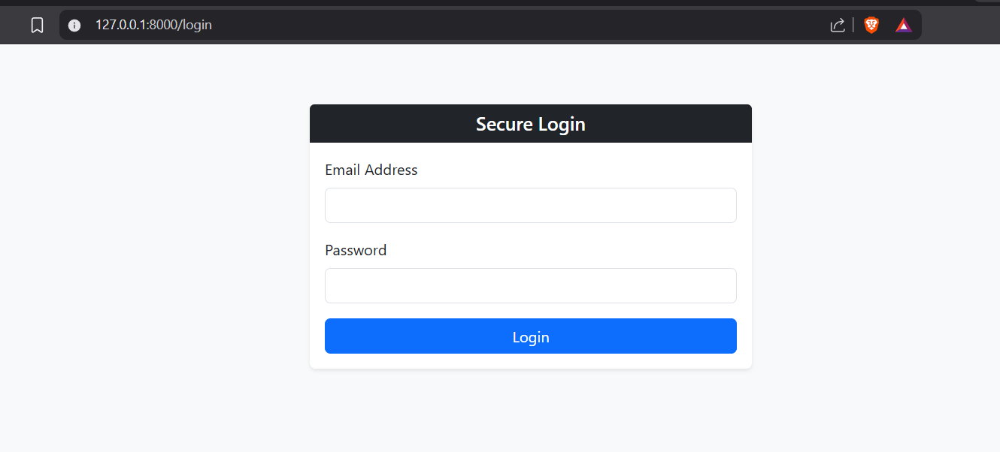
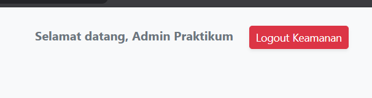
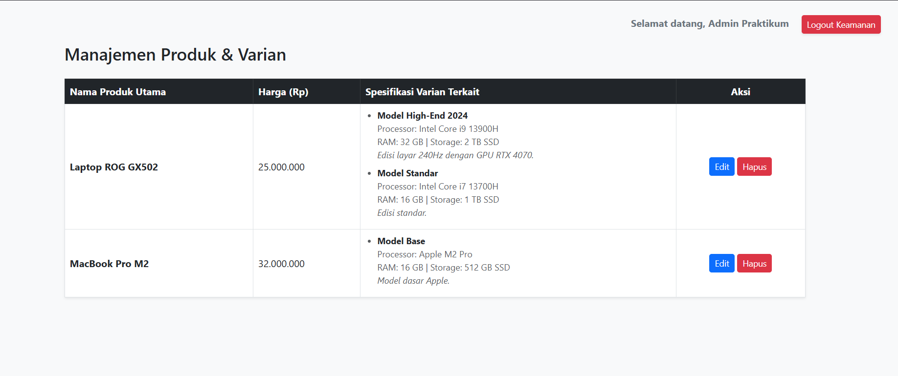
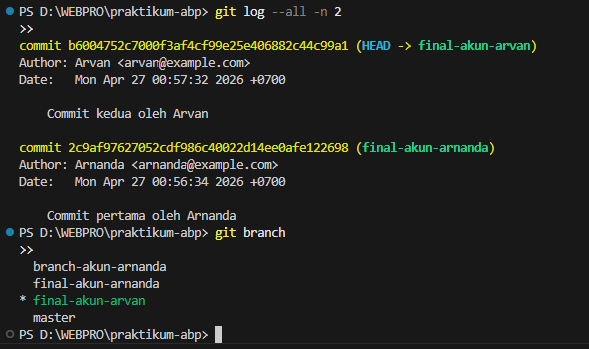
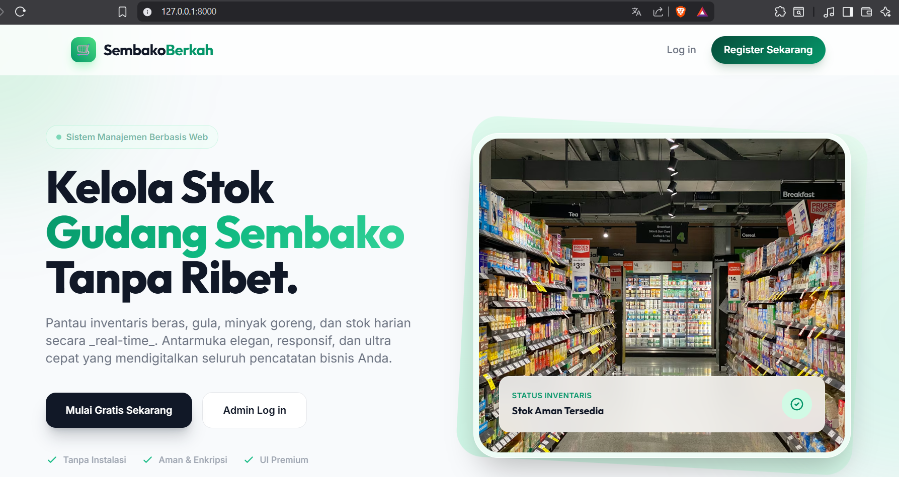
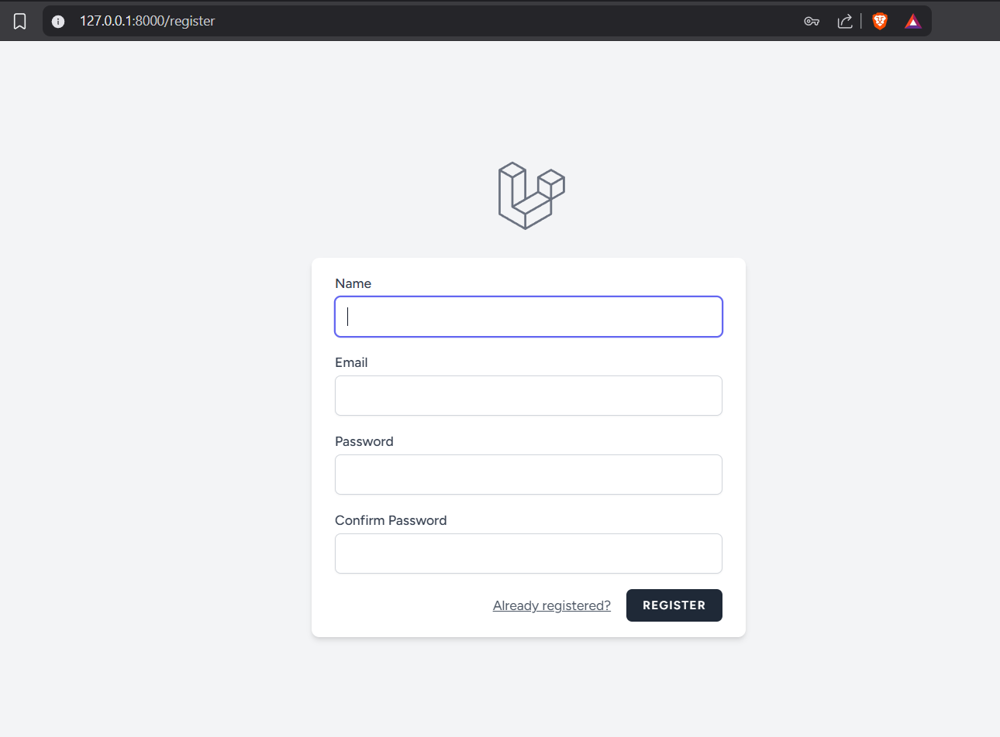
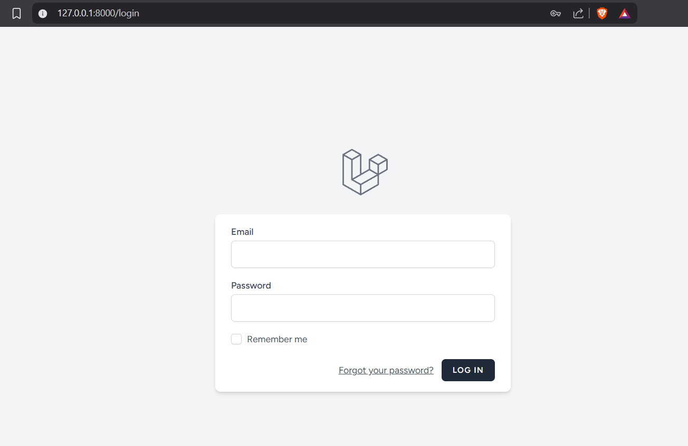
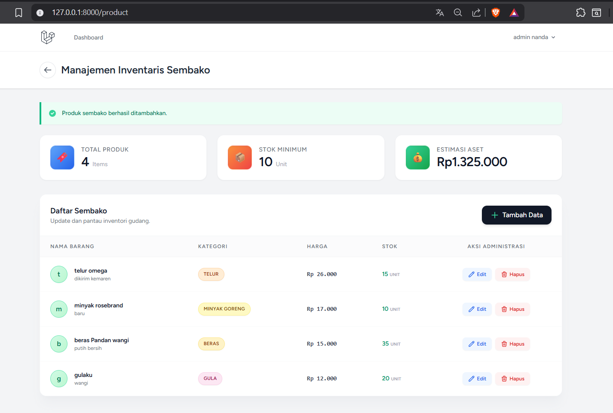
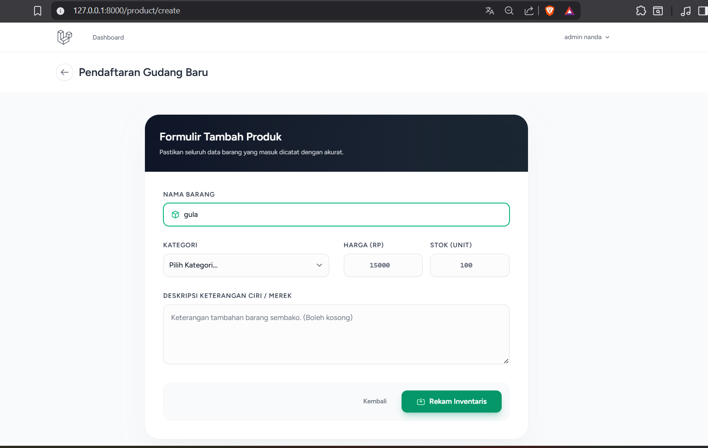
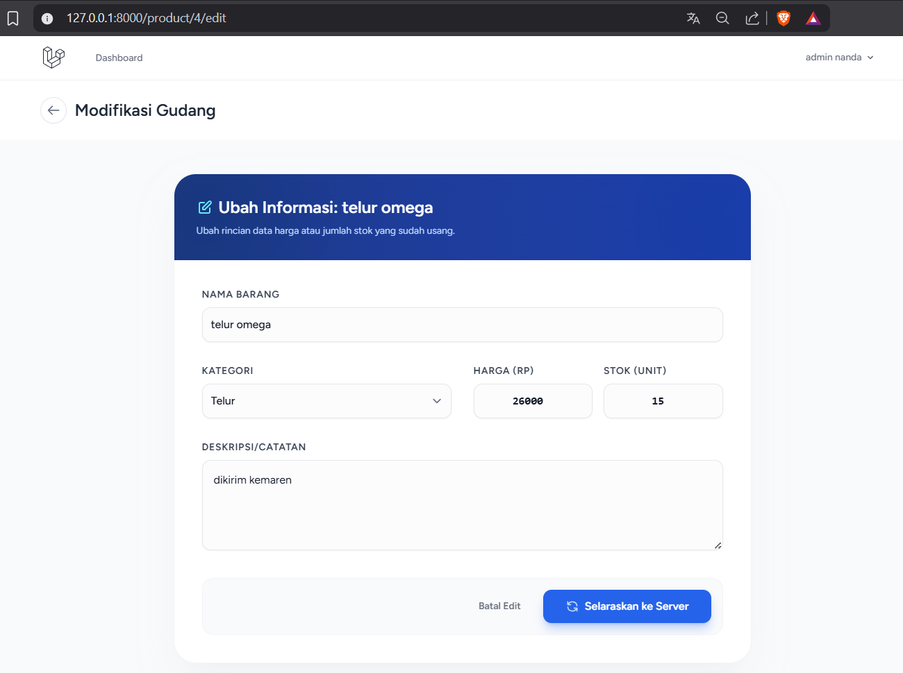

<div align="center">
  <br />

  <h1>LAPORAN PRAKTIKUM <br>
  APLIKASI BERBASIS PLATFORM
  </h1>

  <br />

  <h3>MODUL - 12 & 13<br>
  LARAVEL: DATABASE 2 (AUTH, MIDDLEWARE & RELATIONS) & GIT BRANCHING
  </h3>

  <br />

  

  <br />
  <br />
  <br />

  <h3>Disusun Oleh :</h3>

  <p>
    <strong>Haposan Felix Marcel Siregar</strong><br>
    <strong>2311102210</strong><br>
    <strong>S1 IF-11-XX</strong>
  </p>

  <br />

  <h3>Dosen Pengampu :</h3>

  <p>
    <strong>Cahyo Prihantoro, S.Kom., M.Eng.</strong>
  </p>
  
  <br />

  <h3>LABORATORIUM HIGH PERFORMANCE
  <br>FAKULTAS INFORMATIKA <br>UNIVERSITAS TELKOM PURWOKERTO <br>2026</h3>
</div>

<hr>

# Dasar Praktikum
Pada praktikum modul 13 ini, fokus pengembangan bergeser menuju eskalasi keamanan akses dan perancangan arsitektur *database* yang lebih kompleks pada proyek web **Pixora**. Mahasiswa ditugaskan untuk mengimplementasikan sistem *Authentication* (Login/Logout), manajemen sesi (*Session*), pembatasan akses (*Middleware*), serta menghubungkan antar-entitas data menggunakan skema relasi *One-to-Many* melalui Eloquent ORM di *framework* Laravel.

# Dasar Teori

## 1.1 Manajemen Session
*Session* adalah mekanisme penyimpanan data sementara di sisi server yang terikat pada interaksi pengguna tertentu. Laravel mendukung dua tipe sesi:
* **Session Reguler:** Bertahan selama sesi peramban aktif atau hingga waktu kedaluwarsa habis (misal: menyimpan status login admin studio Pixora).
* **Session Flash:** Hanya bertahan untuk satu siklus *HTTP Request* berikutnya sebelum otomatis terhapus (misal: notifikasi *success* saat jadwal booking ditambahkan).

## 1.2 Keamanan Berlapis via Middleware & Auth
*Middleware* berfungsi sebagai pos pemeriksaan (*checkpoint*) yang menyaring setiap *HTTP Request* yang masuk. Jika suatu *route* diproteksi *Middleware Auth*, pengguna yang belum melalui proses otentikasi akan otomatis ditolak dan diarahkan ke halaman *Login*. 

## 1.3 Model Relasi (Eloquent Relationships)
Laravel Eloquent menyederhanakan *Join* antar tabel menggunakan *Object-Oriented syntax*. Konsep *One-to-Many* (Satu-ke-Banyak) diterapkan pada Pixora; di mana satu paket fotografi (`Package`) dapat dipesan dan terkait dengan banyak data pemesanan (`Booking`) (dikendalikan dengan `hasMany`), sedangkan setiap `Booking` dipastikan merujuk pada satu spesifikasi `Package` tertentu (dikendalikan dengan `belongsTo`). 

---

# PENGERJAAN & IMPLEMENTASI SISTEM

## 2.1 Skema Autentikasi
Akses ke menu pengelolaan paket admin (`/admin/packages`) kini dikunci sepenuhnya. 

| Komponen | Implementasi Logika |
| --- | --- |
| **Routing** | URL `/admin/packages` disematkan `->middleware('auth')`. |
| **Pengecekan (Auth::check)** | Jika *user* (admin) sudah masuk, URL `/login` akan langsung memantulkannya ke *dashboard* admin. |
| **Otentikasi (Auth::attempt)** | Membandingkan masukan *email* dan *password* admin. |

## 2.2 Relasi Entitas Database (One-to-Many)
Tabel pendukung `bookings` dibuat dengan menjaga integritas data menggunakan `foreignId` yang merujuk pada tabel `packages`. Parameter ini memastikan bahwa *ID* paket yang dibooking oleh customer benar-benar valid.

---

## 3. Source Code Praktikum

> **Catatan Engineer:** Desain sistem relasional dan autentikasi untuk Pixora Studio mematuhi standar *Clean Architecture*. Source code penuh yang lebih detail telah disertakan di folder `Source Code/Modul 13`.

### 3.1 Perlindungan Rute (Routing - `routes/web.php`)
```php
<?php
use Illuminate\Support\Facades\Route;
use Illuminate\Support\Facades\Auth;

Route::get('/login', function () {
    if (Auth::check()) return redirect('/admin/packages');
    return view('auth.login');
})->name('login');

Route::prefix('admin')->middleware('auth')->group(function () {
    Route::resource('packages', App\Http\Controllers\Admin\PackageController::class);
});
```

### 3.2 Representasi Model Relasional ORM
Model Package.php (Posisi Induk):
```php
<?php
namespace App\Models;
use Illuminate\Database\Eloquent\Model;

class Package extends Model {
    protected $fillable = ['name', 'price', 'description'];
    public function bookings() {
        return $this->hasMany(Booking::class);
    }
}
```
Model Booking.php (Posisi Anak):
```php
<?php
namespace App\Models;
use Illuminate\Database\Eloquent\Model;

class Booking extends Model {
    protected $fillable = ['booking_code', 'customer_name', 'package_id', 'booking_date'];
    public function package() {
        return $this->belongsTo(Package::class);
    }
}
```

HASIL TAMPILAN WEB (OUTPUT)
Berikut adalah dokumentasi tangkapan layar implementasi Pixora:

1. Tampilan Halaman Login (Proteksi Awal)


2. Tampilan Header Auth di Layout Global


3. Tampilan Halaman Daftar Paket & Booking Pixora


# TUGAS PERTEMUAN 8
1. jelaskan tentang git branch 
- apa itu git branch 
- buatlah git branch dengan 2 akun berbeda dan hubungkan dengan project yang di buat di tugas 2 (Pixora)
- kalian jelaskan apa saja fungsi nya dan apa keuntungan git branch 
- buat juga output dan input apa saja yang dapat kalian lakukan mengunakan git branch

2. buatlah website (Pixora) lalu tambahkan database yang terhubung dengan local house 

## JAWAB
### 1. git branch

- **Git branch** adalah fitur dalam Git yang berfungsi menciptakan ruang kerja terpisah dari repositori utama. Ini memungkinkan pengembang mengembangkan fitur studio/booking baru tanpa mengganggu versi utama Pixora.

### MEMBUAT GIT BRANCH DENGAN 2 AKUN BERBEDA


- **Fungsi dan Keuntungan Git Branch**
  - Fungsi Utama: Isolasi kode untuk fitur spesifik (misal branch `fitur-kalender` dan `fitur-pembayaran`).
  - Keuntungan: Aman dari error fatal di master, pengembangan bisa dilakukan bersama tim (paralel), code review lebih tertata sebelum digabung via Pull Request.

- **Input & Output menggunakan Git Branch**
  - **Input:** Perintah terminal seperti `git branch`, `git checkout -b <branch>`, dan `git merge`.
  - **Output:** Isolasi file source code di IDE, log grafis sejarah commit yang rapi.

### 2. Website Pixora
# 🔥 Sistem Manajemen Studio Pixora (Tugas 8)

Proyek ini dibangun menggunakan **Laravel 11** dan ditujukan untuk mengimplementasikan manajemen basis data relasional (MySQL/PostgreSQL) pada layanan pemotretan studio fotography Pixora. Aplikasi memiliki *Landing Page* untuk pelanggan, serta *Dashboard Admin* yang menggunakan Laravel Breeze untuk keamanan otentikasi.

## 💻 Source Code Inti Sistem
*Berikut adalah ringkasan kode di dalam `modul-13/tugas-8`. File lengkap ada pada folder Source Code.*

### Konfigurasi `.env`
```env
DB_CONNECTION=mysql
DB_HOST=127.0.0.1
DB_PORT=3306
DB_DATABASE=pixora_db
DB_USERNAME=root
DB_PASSWORD=
```

## OUTPUT WEBSITE PIXORA (SS)
### 1. Landing Page Pixora


### 2. Register Admin


### 3. Login Admin


### 4. Dashboard Admin Pixora


### 5. Tambah Paket Fotografi


### 6. Edit Paket Fotografi

