# InventarisKu - Aplikasi Manajemen Produk Laravel

**Nama:** Muhammad Rafiful Hana  
**NIM:** 2311102227  
**Fakultas:** Teknik Informatika - Telkom University  

---

## Daftar Isi

1. [Deskripsi](#deskripsi)
2. [Fitur Utama](#fitur-utama)
3. [Teknologi](#teknologi)
4. [Screenshots / Output Aplikasi](#screenshots--output-aplikasi)
5. [Instalasi](#instalasi)
6. [Struktur Database](#struktur-database)
7. [Struktur Folder](#struktur-folder)
8. [Endpoint API / Routes](#endpoint-api--routes)
9. [Kode Program](#kode-program)
10. [Cara Penggunaan](#cara-penggunaan)
11. [Troubleshooting](#troubleshooting)
12. [Referensi](#referensi)

---

## Deskripsi

Sistem web manajemen inventaris produk bernama **InventarisKu** yang dibangun menggunakan framework Laravel. Aplikasi ini memiliki sistem autentikasi (registrasi dan login) serta fitur CRUD (Create, Read, Update, Delete) untuk mengelola data produk. Setiap pengguna hanya dapat mengelola produk miliknya sendiri (data terisolasi per pengguna). Desain menggunakan gaya neurobrutalist dengan tampilan yang tegas, kontras, dan ekspresif.

---

## Fitur Utama

1. **Sistem Autentikasi**
   - Registrasi pengguna baru dengan validasi
   - Login dengan email dan password
   - Logout
   - Edit profil pengguna

2. **Manajemen Produk (CRUD)**
   - Menampilkan daftar produk dalam tabel
   - Menambah produk baru (nama, deskripsi, harga, stok)
   - Mengedit data produk
   - Menghapus produk dengan konfirmasi
   - Data produk terisolasi per pengguna (hanya pemilik yang bisa mengelola)

3. **Tampilan Neurobrutalist**
   - Navbar hitam dengan aksen merah (#c0392b)
   - Card dengan shadow tebal khas brutalist
   - Tombol dengan efek hover scale
   - Tabel dengan header hitam dan hover effect
   - Alert dengan border kiri berwarna
   - Footer dengan identitas mahasiswa

4. **Keamanan**
   - Autentikasi Laravel Breeze
   - Middleware auth untuk proteksi route
   - Policy untuk kepemilikan data produk
   - CSRF protection

---

## Teknologi

**Backend:**
- Laravel 11
- PHP 8.2+
- MySQL / MariaDB

**Frontend:**
- Blade Templating Engine
- CSS3 Neurobrutalist Design (tanpa framework CSS eksternal)
- Font Awesome 6
- Google Fonts (Space Mono, Inter)

---

## Screenshots / Output Aplikasi

### 1. Halaman Register

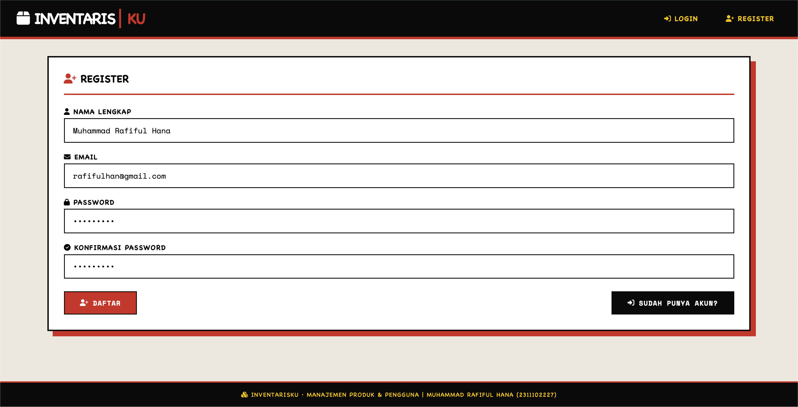

Halaman registrasi pengguna baru dengan form input nama, email, password, dan konfirmasi password. Menggunakan layout neurobrutalist.

### 2. Halaman Login

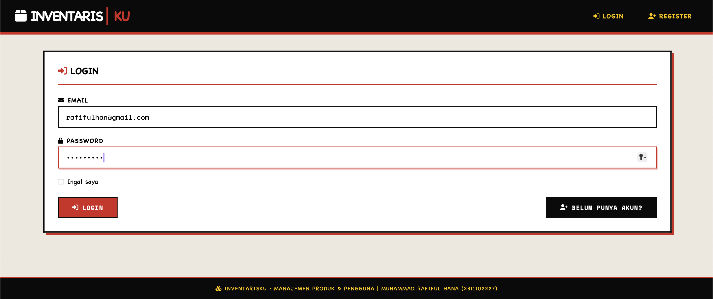

Halaman login dengan form input email dan password. Terdapat link untuk registrasi dan "forgot password".

### 3. Halaman Dashboard Produk

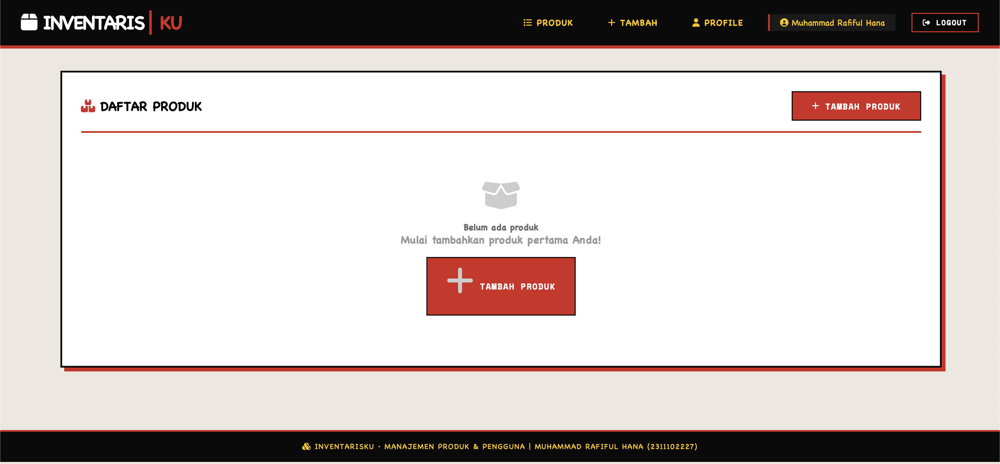

Halaman utama setelah login yang menampilkan daftar produk dalam tabel neurobrutalist. Header menampilkan judul "Daftar Produk" dan tombol "Tambah Produk".

### 4. Form Tambah Produk

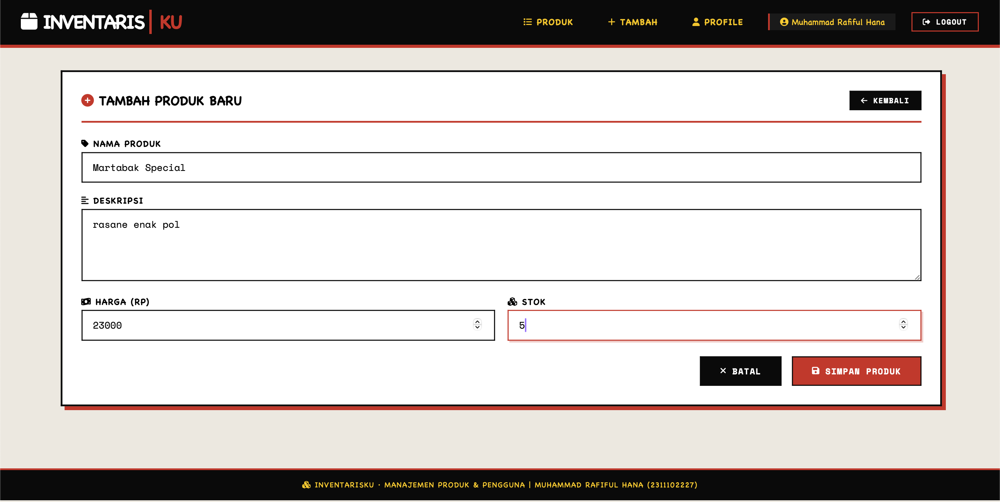

Halaman form untuk menambah produk baru dengan input: nama produk, deskripsi, harga, dan stok.

### 5. Hasil Tambah Produk

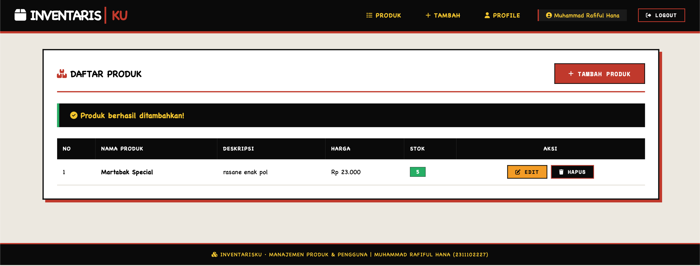

Data produk baru berhasil ditambahkan dan tampil dalam tabel bersama data lainnya. Alert sukses berwarna hijau muncul di bagian atas.

### 6. Form Edit Produk

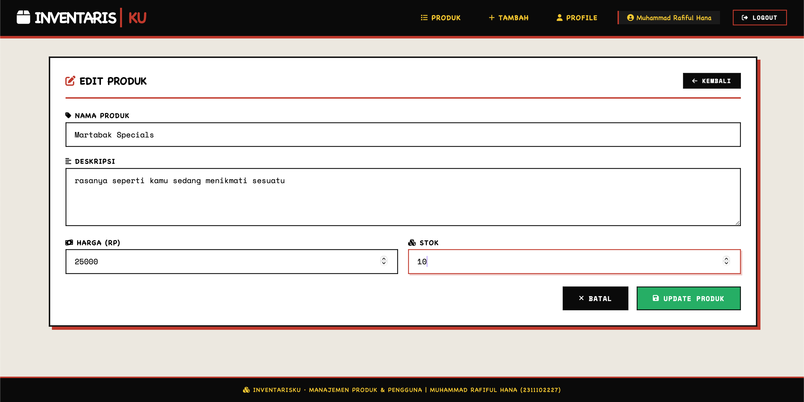

Halaman form dalam mode edit, menampilkan data produk yang sudah ada untuk diubah.

### 7. Hasil Edit Produk

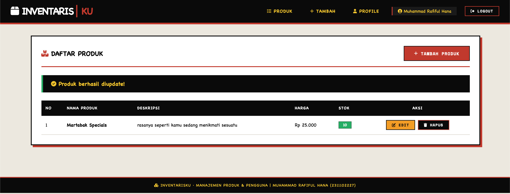

Data produk berhasil diperbarui. Perubahan harga, stok, atau field lainnya tercermin dalam tabel.

### 8. Konfirmasi Hapus Produk

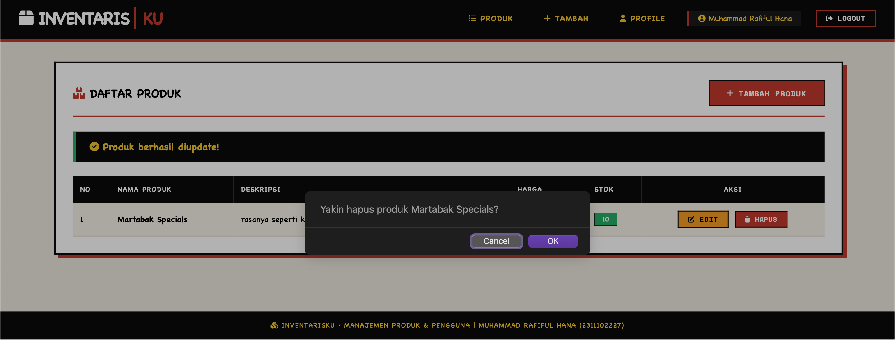

Tombol hapus pada setiap baris produk. Penghapusan menggunakan method DELETE dengan konfirmasi dari Laravel.

### 9. Hasil Hapus Produk

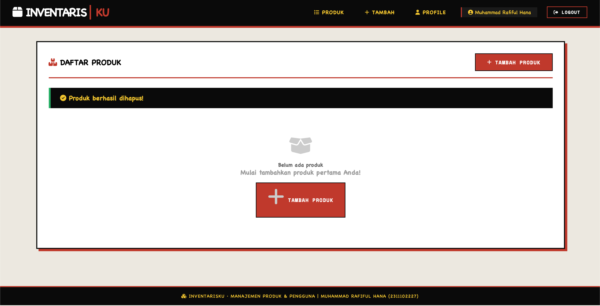

Data produk berhasil dihapus dan tidak lagi muncul dalam tabel. Alert sukses ditampilkan.

### 10. Tabel Migrations

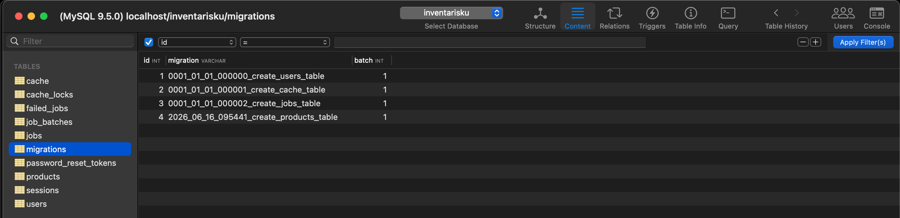

Struktur tabel migrations di database yang mencatat semua migration yang telah dijalankan.

### 11. Tabel Products

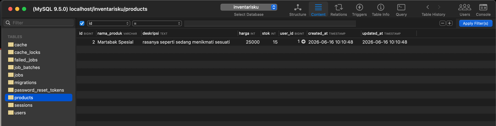

Struktur tabel products yang menyimpan data produk dengan kolom: id, nama_produk, deskripsi, harga, stok, user_id, created_at, updated_at.

### 12. Tabel Sessions

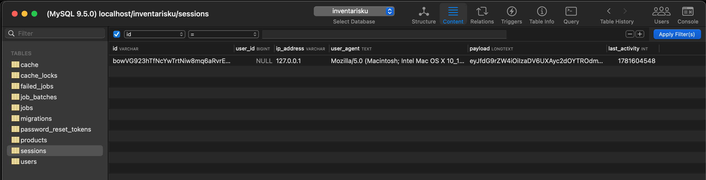

Struktur tabel sessions untuk menyimpan data session pengguna yang login.

### 13. Tabel Users

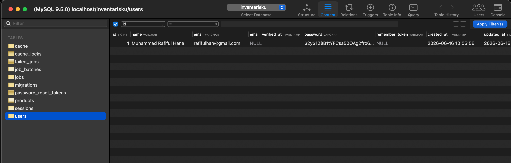

Struktur tabel users yang menyimpan data pengguna dengan kolom: id, name, email, email_verified_at, password, remember_token, created_at, updated_at.

---

## Instalasi

1. Clone repository

```bash
git clone <repository-url>
cd inventarisku
```

2. Install dependencies

```bash
composer install
```

3. Copy file environment

```bash
cp .env.example .env
```

4. Generate application key

```bash
php artisan key:generate
```

5. Konfigurasi database di file `.env`

```env
DB_CONNECTION=mysql
DB_HOST=127.0.0.1
DB_PORT=3306
DB_DATABASE=inventarisku
DB_USERNAME=root
DB_PASSWORD=
```

6. Buat database

```sql
CREATE DATABASE inventarisku;
```

7. Jalankan migration

```bash
php artisan migrate
```

8. Install前端 dependencies (opsional, untuk Vite)

```bash
npm install
npm run build
```

9. Jalankan server

```bash
php artisan serve
```

10. Akses aplikasi

Buka browser: http://localhost:8000

---

## Struktur Database

### Tabel users

| Kolom             | Tipe           | Keterangan                         |
|-------------------|----------------|------------------------------------|
| id                | bigint(20)     | Primary key, auto increment        |
| name              | varchar(255)   | Nama lengkap pengguna              |
| email             | varchar(255)   | Unique, untuk login                |
| email_verified_at | timestamp      | Verifikasi email (nullable)        |
| password          | varchar(255)   | Hash password                      |
| remember_token    | varchar(100)   | Token remember me (nullable)       |
| created_at        | timestamp      | Waktu registrasi                   |
| updated_at        | timestamp      | Waktu update terakhir              |

### Tabel products

| Kolom        | Tipe           | Keterangan                         |
|--------------|----------------|------------------------------------|
| id           | bigint(20)     | Primary key, auto increment        |
| nama_produk  | varchar(255)   | Nama produk                        |
| deskripsi    | text           | Deskripsi produk (nullable)        |
| harga        | integer        | Harga produk                       |
| stok         | integer        | Jumlah stok (default 0)            |
| user_id      | bigint(20)     | Foreign key ke users.id            |
| created_at   | timestamp      | Waktu input produk                 |
| updated_at   | timestamp      | Waktu update terakhir              |

---

## Struktur Folder

```
inventarisku/
├── output/                            # Screenshot hasil aplikasi
│   ├── 1.register.png
│   ├── 2.login.png
│   ├── 3.dashboard-product.png
│   ├── 4.add-product.png
│   ├── 5.add-product-result.png
│   ├── 6.edit-product.png
│   ├── 7.edit-product-result.png
│   ├── 8.delete.png
│   ├── 8.delete-result.png
│   ├── migration-table.png
│   ├── product-table.png
│   ├── sessions-table.png
│   └── users-table.png
│
├── app/
│   ├── Http/
│   │   └── Controllers/
│   │       ├── ProductController.php    # Controller CRUD produk
│   │       └── ProfileController.php    # Controller profil pengguna
│   ├── Models/
│   │   ├── Product.php                  # Model produk
│   │   └── User.php                     # Model pengguna
│   └── Providers/
│
├── bootstrap/
├── config/
├── database/
│   └── migrations/
│       └── xxxx_create_products_table.php
│
├── public/
├── resources/
│   └── views/
│       ├── layouts/
│       │   └── app.blade.php           # Layout utama neurobrutalist
│       ├── auth/
│       │   ├── login.blade.php
│       │   └── register.blade.php
│       └── products/
│           ├── index.blade.php         # Daftar produk
│           ├── create.blade.php        # Tambah produk
│           └── edit.blade.php          # Edit produk
│
├── routes/
│   └── web.php                         # Route definitions
│
├── storage/
├── composer.json
├── package.json
├── artisan
└── vite.config.js
```

---

## Endpoint API / Routes

| Method   | Endpoint            | Deskripsi                              | Middleware |
|----------|---------------------|----------------------------------------|------------|
| GET      | /                   | Halaman welcome                        | -          |
| GET      | /dashboard          | Dashboard (redirect ke produk)         | auth       |
| GET      | /login              | Halaman login                          | guest      |
| POST     | /login              | Proses login                           | guest      |
| GET      | /register           | Halaman register                       | guest      |
| POST     | /register           | Proses registrasi                      | guest      |
| POST     | /logout             | Proses logout                          | auth       |
| GET      | /products           | Daftar produk                          | auth       |
| GET      | /products/create    | Form tambah produk                     | auth       |
| POST     | /products           | Simpan produk baru                     | auth       |
| GET      | /products/{id}/edit | Form edit produk                       | auth       |
| PUT/PATCH| /products/{id}      | Update produk                          | auth       |
| DELETE   | /products/{id}      | Hapus produk                           | auth       |
| GET      | /profile            | Edit profil                            | auth       |
| PATCH    | /profile            | Update profil                          | auth       |

---

## Kode Program

### Controller ProductController.php

```php
<?php
namespace App\Http\Controllers;

use App\Models\Product;
use Illuminate\Http\Request;
use Illuminate\Support\Facades\Auth;

class ProductController extends Controller
{
    public function index()
    {
        $products = Product::where('user_id', Auth::id())->latest()->get();
        return view('products.index', compact('products'));
    }

    public function create()
    {
        return view('products.create');
    }

    public function store(Request $request)
    {
        $request->validate([
            'nama_produk' => 'required|string|max:255',
            'deskripsi' => 'nullable|string',
            'harga' => 'required|numeric|min:0',
            'stok' => 'required|integer|min:0',
        ]);

        Product::create([
            'nama_produk' => $request->nama_produk,
            'deskripsi' => $request->deskripsi,
            'harga' => $request->harga,
            'stok' => $request->stok,
            'user_id' => Auth::id()
        ]);

        return redirect()->route('products.index')->with('success', 'Produk berhasil ditambahkan!');
    }

    public function edit(Product $product)
    {
        if ($product->user_id !== Auth::id()) {
            abort(403, 'Anda tidak berwenang mengedit produk ini');
        }
        return view('products.edit', compact('product'));
    }

    public function update(Request $request, Product $product)
    {
        if ($product->user_id !== Auth::id()) {
            abort(403, 'Anda tidak berwenang mengupdate produk ini');
        }

        $request->validate([
            'nama_produk' => 'required|string|max:255',
            'deskripsi' => 'nullable|string',
            'harga' => 'required|numeric|min:0',
            'stok' => 'required|integer|min:0',
        ]);

        $product->update($request->all());
        return redirect()->route('products.index')->with('success', 'Produk berhasil diupdate!');
    }

    public function destroy(Product $product)
    {
        if ($product->user_id !== Auth::id()) {
            abort(403, 'Anda tidak berwenang menghapus produk ini');
        }
        
        $product->delete();
        return redirect()->route('products.index')->with('success', 'Produk berhasil dihapus!');
    }
}
```

### Model Product.php

```php
<?php
namespace App\Models;

use Illuminate\Database\Eloquent\Model;
use Illuminate\Database\Eloquent\Relations\BelongsTo;

class Product extends Model
{
    protected $fillable = [
        'nama_produk',
        'deskripsi',
        'harga',
        'stok',
        'user_id'
    ];

    public function user(): BelongsTo
    {
        return $this->belongsTo(User::class);
    }
}
```

### Routes (web.php)

```php
<?php
use Illuminate\Support\Facades\Route;
use App\Http\Controllers\ProductController;
use App\Http\Controllers\ProfileController;

Route::get('/', function () {
    return view('welcome');
});

Route::get('/dashboard', function () {
    return view('dashboard');
})->middleware(['auth'])->name('dashboard');

Route::middleware('auth')->group(function () {
    Route::get('/profile', [ProfileController::class, 'edit'])->name('profile.edit');
    Route::patch('/profile', [ProfileController::class, 'update'])->name('profile.update');
    Route::delete('/profile', [ProfileController::class, 'destroy'])->name('profile.destroy');
    Route::resource('products', ProductController::class);
});

require __DIR__.'/auth.php';
```

### Migration Products Table

```php
<?php
use Illuminate\Database\Migrations\Migration;
use Illuminate\Database\Schema\Blueprint;
use Illuminate\Support\Facades\Schema;

return new class extends Migration
{
    public function up()
    {
        Schema::create('products', function (Blueprint $table) {
            $table->id();
            $table->string('nama_produk');
            $table->text('deskripsi')->nullable();
            $table->integer('harga');
            $table->integer('stok')->default(0);
            $table->foreignId('user_id')->constrained()->onDelete('cascade');
            $table->timestamps();
        });
    }

    public function down()
    {
        Schema::dropIfExists('products');
    }
};
```

---

## Cara Penggunaan

1. **Registrasi Akun**
   - Buka halaman `/register`
   - Isi form nama, email, password, dan konfirmasi password
   - Klik tombol Register

2. **Login**
   - Buka halaman `/login`
   - Masukkan email dan password
   - Klik tombol Login

3. **Melihat Daftar Produk**
   - Setelah login, halaman utama menampilkan daftar produk
   - Setiap pengguna hanya melihat produk miliknya sendiri

4. **Menambah Produk**
   - Klik tombol "Tambah Produk" atau navigasi "Tambah"
   - Isi form nama produk, deskripsi, harga, dan stok
   - Klik "Simpan"

5. **Mengedit Produk**
   - Klik tombol "Edit" pada baris produk yang ingin diubah
   - Ubah data yang diperlukan
   - Klik "Update"

6. **Menghapus Produk**
   - Klik tombol "Hapus" pada baris produk
   - Data akan terhapus secara permanen

7. **Edit Profil**
   - Klik navigasi "Profile"
   - Ubah nama atau email
   - Klik "Update"

8. **Logout**
   - Klik tombol "Logout" di navbar

---

## Troubleshooting

**Error 500 saat akses halaman**
- Pastikan sudah menjalankan `php artisan key:generate`
- Cek permission folder: `chmod -R 775 storage bootstrap/cache`

**Error Database**
- Pastikan MySQL server berjalan
- Cek kredensial database di file `.env`
- Pastikan database sudah dibuat: `CREATE DATABASE inventarisku;`
- Jalankan `php artisan migrate`

**Error 419 Page Expired**
- Pastikan CSRF token sudah disertakan dalam form
- Refresh halaman

**Error Class not found**
- Jalankan `composer dump-autoload`

---

## Referensi

- [Laravel 11 Documentation](https://laravel.com/docs/11.x)
- [Laravel Breeze](https://laravel.com/docs/11.x/starter-kits#laravel-breeze)
- [Font Awesome Icons](https://fontawesome.com/icons)
- [Google Fonts - Space Mono](https://fonts.google.com/specimen/Space+Mono)
- [PHP Documentation](https://www.php.net/docs.php)
- [MySQL Documentation](https://dev.mysql.com/doc/)
- [Neurobrutalism Design](https://www.awwwards.com/neuro-brutalism/)
- Telkom University - Program Studi S1 Informatika